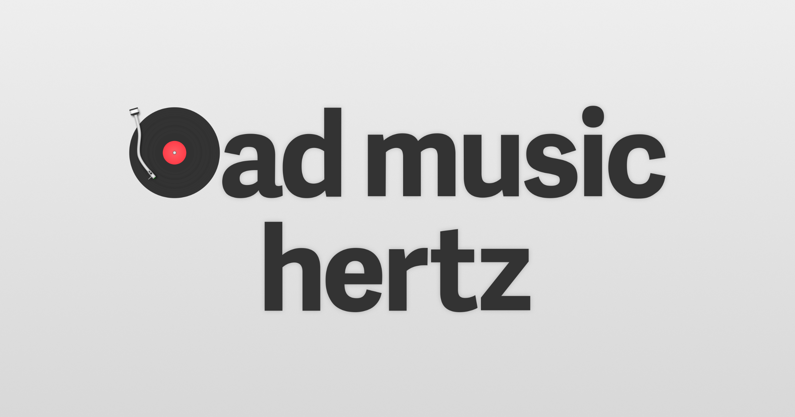

  

Albums are the movies and books of sound. With just music and album art as their tools, artists manage to capture our hearts and minds with a seemingly endless breadth of experiences. It can be whisking us away to dream like places of adventure, guiding us through character driven emotional journeys of the human spirit, sonically painting grand operas of time and space, and everything in between. Both Marc and Michael Barrowclift have set out to reflect on both the good and bad albums of their past and highlight brand new ones along the way. Plug in, start Track 1, and [let's listen to albums again](http://badmusichertz.com).